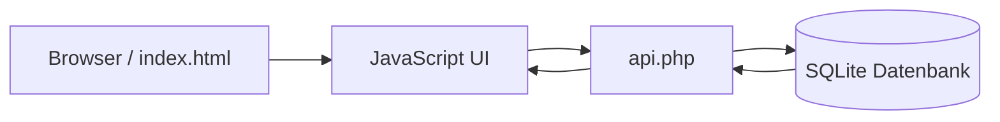

# 🎓 trt.Schuelermanager

<div align="center">


<h3>📚 Leichtgewichtiger, webbasierter Schüler-Manager für den schnellen Einsatz im Unterricht</h3>

<p>
  Schülerdaten, Noten, Sozialpunkte, Besonderheiten und Bilder – alles in einer kompakten Anwendung ohne schweres Framework.
</p>

<p>
  <a href="#-installation">Installation</a> •
  <a href="#-funktionen">Funktionen</a> •
  <a href="#-dokumentation">Dokumentation</a> •
  <a href="#-lizenz">Lizenz</a> •
  <a href="https://www.buymeacoffee.com/jbkunama1">☕ Buy Me a Coffee</a>
</p>

</div>

---

## 🌈 Projektüberblick

**trt.Schuelermanager** ist eine schlanke Webanwendung für Lehrkräfte, die Schülerdaten direkt im Browser verwalten möchten.  
Die Anwendung kombiniert ein einfaches HTML/JavaScript-Frontend mit einem PHP-Backend und speichert Daten lokal in einer SQLite-Datenbank.

### 💡 Ideal für

- 🏫 Unterrichtsalltag in Schule, AG oder Projektgruppe
- 📝 Verwaltung von schriftlichen und mündlichen Noten
- 🤝 Dokumentation von Sozialpunkten und Besonderheiten
- 🖼️ Zuordnung von Schülerfotos
- 🖨️ Schnellen Ausdruck oder PDF-Export

---

## 🖼️ Vorschau

<div align="center">
  
</div>

---

## ✨ Funktionen

| Bereich | Beschreibung |
|---|---|
| 👨‍🎓 Schülerverwaltung | Schüler anlegen, bearbeiten und löschen |
| 🏷️ Stammdaten | Name, Klasse, Fach und Zusatzinformationen erfassen |
| 🧠 Besonderheiten | Hinweise wie LRS, Allergien oder individuelle Stärken dokumentieren |
| 📈 Sozialpunkte | Sozialverhalten schnell numerisch festhalten |
| 📝 Notenverwaltung | Schriftliche und mündliche Noten separat speichern |
| 📊 Statistiken | Durchschnittswerte und Gesamtübersicht direkt im Dashboard |
| 🔎 Filter & Suche | Nach Namen, Klassen oder Fächern filtern |
| 🖼️ Bilder | Schülerfoto im Datensatz hinterlegen |
| 📄 Export | PDF-Ausgabe und Druckfunktion |

---

## 🧰 Technologie-Stack

- **Frontend:** HTML5, CSS3, Vanilla JavaScript
- **Backend:** PHP
- **Datenhaltung:** SQLite via PDO
- **Assets:** lokales Icon und lokales Vorschaubild

---

## 🗂️ Projektstruktur

```text
trt.Schuelermanager/
├── api.php                         # PHP-API für Laden, Speichern und Löschen
├── index.html                      # Benutzeroberfläche
├── schueler_manager.db             # SQLite-Datenbank
├── RealTeacherSchuelerManager.ico  # Favicon
├── RealTeacherSchuelerManager.png  # Grafik/Screenshot
├── README.md                       # Projektdokumentation
└── LICENSE                         # MIT-Lizenz
```

---

## 🚀 Installation

### Voraussetzungen

- PHP **8 oder neuer**
- aktivierte PHP-Erweiterung **pdo_sqlite**
- ein Webserver oder der integrierte PHP-Server
- Schreibrechte im Projektverzeichnis für die SQLite-Datei

### 1. Repository bereitstellen

Projekt lokal in ein Webverzeichnis legen oder direkt ausführen.

### 2. PHP-Server starten

Im Projektordner:

```bash
php -S localhost:8000
```

### 3. Anwendung öffnen

Im Browser aufrufen:

```text
http://localhost:8000/index.html
```

### 4. Datenbank

Beim Start nutzt die Anwendung die Datei **`schueler_manager.db`** im Projektverzeichnis.  
Die benötigte Tabelle wird durch `api.php` automatisch angelegt.

---

## ▶️ Schnellstart

1. Anwendung im Browser öffnen
2. Anmelden
3. Über **„➕ Neuer Schüler“** einen Datensatz anlegen
4. Noten, Sozialpunkte und Zusatzinformationen ergänzen
5. Bei Bedarf als PDF exportieren oder drucken

---

## 📘 Dokumentation

### Daten, die je Schüler gespeichert werden

- Name
- Klasse
- Fach
- Besonderheiten
- Sozialpunkte
- Schriftliche Noten
- Mündliche Noten
- Sonstige Infos
- Bilddaten

### Arbeitsweise der Anwendung



### API-Übersicht

| Methode | Aktion | Zweck |
|---|---|---|
| `GET` | `?action=getAll` | Alle Schüler laden |
| `POST` | `save` | Schüler neu anlegen oder aktualisieren |
| `POST` | `delete` | Schüler löschen |

### Bedienhinweise

- Die Oberfläche ist für Desktop und mobile Ansicht ausgelegt.
- Filter funktionieren nach **Name**, **Klasse** und **Fach**.
- Durchschnittswerte für Noten werden automatisch berechnet.
- Druckansicht blendet störende UI-Elemente aus.

---

## 🔐 Hinweise für den Einsatz

- Die Anwendung ist bewusst **leichtgewichtig** gehalten.
- Für produktive Nutzung sollten **Passwortschutz, Rollenmodell und Absicherung der API** erweitert werden.
- Das Projektverzeichnis muss beschreibbar sein, damit SQLite Änderungen speichern kann.
- Bei öffentlichem Hosting sollten zusätzliche Datenschutz- und Sicherheitsmaßnahmen umgesetzt werden.

---

## 🛠️ Weiterentwicklungsideen

- ✅ CSV-Import / Export
- ✅ Backup- und Restore-Funktion
- ✅ Mehrbenutzerfähigkeit
- ✅ Stärkere Authentifizierung
- ✅ Klassenbezogene Reports
- ✅ Hosting mit Login-Session statt einfachem Frontend-Check

---

## ☕ Support

Wenn dir das Projekt gefällt und du die Weiterentwicklung unterstützen möchtest:

<p>
  <a href="https://www.buymeacoffee.com/jbkunama1">
    
  </a>
</p>

---

## 📄 Lizenz

Dieses Projekt steht unter der **MIT-Lizenz**.  
Details siehe Datei [`LICENSE`](./LICENSE).
